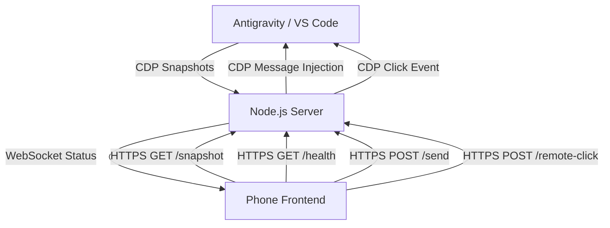

# CODE DOCUMENTATION - Antigravity Phone Connect

## Project Structure
```text
antigravity_phone_chat/
├── server.js               # Main Node.js server (Express + WebSocket + CDP + HTTPS)
├── generate_ssl.js         # SSL certificate generator (pure Node.js, no OpenSSL needed)
├── ui_inspector.js         # Utility for inspecting VS Code/Antigravity UI via CDP
├── public/
│   └── index.html          # Mobile-optimized web frontend
├── certs/                   # SSL certificates directory (auto-generated, gitignored)
│   ├── server.key          # Private key
│   └── server.cert         # Self-signed certificate
├── start_ag_phone_connect.bat  # Windows launcher (auto-detects HTTPS)
├── start_ag_phone_connect.sh   # Mac/Linux launcher (auto-detects HTTPS)
├── install_context_menu.bat    # Windows context menu manager
├── install_context_menu.sh     # Linux context menu manager
├── package.json            # Dependencies and metadata
├── LICENSE                 # GPL v3 License
└── README.md               # Quick-start guide
```

## High-Level Architecture
The system acts as a "Headless Mirror" of the Antigravity session running on a Desktop machine. It utilizes the **Chrome DevTools Protocol (CDP)** to bridge the gap between a local VS Code instance and a remote mobile browser.

### Data Flow


## Core Modules & Methods (server.js)

| Module/Function | Description |
| :--- | :--- |
| `killPortProcess()` | Automatically kills any existing process on the server port (prevents EADDRINUSE errors). Works on Windows/Linux/macOS. |
| `getLocalIP()` | Detects local network IP address for mobile access display. |
| `discoverCDP()` | Scans ports (9000-9003) to find the Antigravity instance. |
| `connectCDP()` | Establishes CDP WebSocket with centralized message handling (prevents memory leaks). Uses `pendingCalls` Map with 30s timeout. |
| `captureSnapshot()` | Injects JS into Antigravity to clone the chat DOM, extract CSS, and return it. |
| `loadSnapshot()` (Client) | Renders the HTML snapshot and injects CSS overrides for dark mode. |
| `injectMessage()` | Locates the Antigravity input field and simulates typing/submission. Uses `JSON.stringify` for safe escaping. |
| `setMode()` / `setModel()` | Robust text-based selectors to change AI settings remotely. |
| `clickElement()` | Relays a physical click from the phone to a specific element index on Desktop. |
| `remoteScroll()` | Syncs phone scroll position to Desktop Antigravity chat. |
| `getAppState()` | Syncs Mode/Model status by scraping the Desktop UI text nodes (detects clickable elements). |
| `gracefulShutdown()` | Handles SIGINT/SIGTERM for clean server shutdown. |
| `createServer()` | Creates Express app with automatic HTTP/HTTPS detection based on SSL cert availability. |

## API Endpoints

| Endpoint | Method | Description |
| :--- | :--- | :--- |
| `/health` | GET | Returns server status, CDP connection state, uptime, and timestamp. |
| `/snapshot` | GET | Returns latest captured HTML/CSS snapshot. |
| `/app-state` | GET | Returns current Mode (Fast/Planning) and Model. |
| `/ssl-status` | GET | Returns HTTPS status and certificate info. |
| `/send` | POST | Sends a message to the Antigravity chat. Always returns 200 (optimistic). |
| `/stop` | POST | Stops the current AI generation. |
| `/set-mode` | POST | Changes mode to Fast or Planning. |
| `/set-model` | POST | Changes the AI model. |
| `/remote-click` | POST | Triggers a click event on Desktop (for Thought expansion). |
| `/remote-scroll` | POST | Syncs phone scroll position to Desktop Antigravity. |
| `/generate-ssl` | POST | Generates SSL certificates (for HTTPS setup via UI). |
| `/debug-ui` | GET | Returns serialized UI tree for debugging. |

## HTTPS/SSL Support

The server automatically detects SSL certificates and enables HTTPS:

1. **Certificate Generation**: Run `node generate_ssl.js`
   - **Hybrid approach**: Tries OpenSSL first (better SAN support), falls back to Node.js crypto
   - Automatically detects local IP addresses for certificate SANs
2. **Auto-Detection**: Server checks for `certs/server.key` and `certs/server.cert`
3. **Protocol Selection**: Uses HTTPS if certs exist, HTTP otherwise
4. **WebSocket**: Automatically uses `wss://` for secure WebSocket when HTTPS is enabled
5. **Web UI**: Users can generate certificates via the "Enable HTTPS" button when running HTTP

## Dependencies

- **Express**: HTTP/HTTPS server for UI and API endpoints.
- **ws**: WebSocket implementation for real-time update notifications.
- **os**: Node.js built-in for local IP detection.
- **fs**: Node.js built-in for SSL certificate file reading.
- **https**: Node.js built-in for secure server (when SSL enabled).
- **Chrome DevTools Protocol (CDP)**: The underlying bridge to VS Code's browser-based UI.

## Execution Flow

> ⚠️ **The order of these steps matters!** Always start Antigravity with an active chat BEFORE running the server.

### Required Startup Sequence:

1. **Start Antigravity in Debug Mode**
   - Launch Antigravity with: `antigravity . --remote-debugging-port=9000`
   - Or use the context menu: Right-click folder → "Open with Antigravity (Debug)"

2. **Open or Start a Chat**
   - Open an existing chat from the bottom-right panel, OR
   - Start a new chat by typing a message
   - ⚠️ The server requires an active chat (the `#cascade` element) to capture snapshots

3. **Run the Server** (`start_ag_phone_connect.bat` or `.sh`)
   - **Port Cleanup**: Server automatically kills any existing process on port 3000
   - **CDP Discovery**: Scans ports 9000-9003 to find the running Antigravity instance
   - **SSL Check**: Checks for certificates in `./certs/` and enables HTTPS if found
   - **Polling Starts**: Once connected, polls the UI every 1 second for changes

4. **Connect Your Phone**
   - Open the URL shown in terminal (e.g., `https://192.168.1.5:3000`)
   - Accept SSL certificate warning on first visit
   - Phone receives snapshots via WebSocket notifications

### Runtime Behavior:

- **Snapshot Updates**: If content hash changes, clients are notified via WebSocket
- **Rendering**: Mobile client fetches latest HTML/CSS and renders in a sandboxed div
- **Interaction**: User actions (Send, Stop, Mode/Model changes) are POST requests → CDP commands
- **Scroll Sync**: Phone scroll position syncs to Desktop with user scroll lock protection
- **Shutdown**: On SIGINT/SIGTERM, server gracefully closes all connections before exit

## Security Considerations

- **Self-Signed Certificates**: The generated certificates are self-signed and browser will show a warning on first visit.
- **Local Network Only**: By default, only accessible on LAN. Not exposed to internet.
- **No Authentication**: Currently no auth layer - anyone on the same network can access.
- **Input Sanitization**: User input is escaped using `JSON.stringify` before CDP injection.

> 📚 For detailed security information, browser warning bypass instructions, and recommendations, see [SECURITY.md](SECURITY.md).
